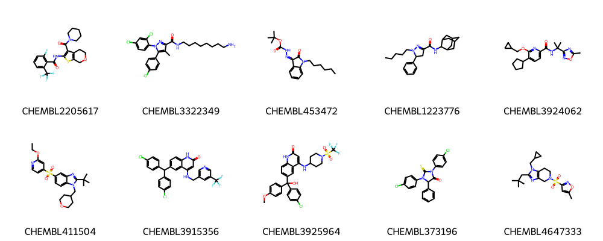

&nbsp;&nbsp;


# ChemicalSpace

An Object-Oriented Representation for Chemical Spaces

`chemicalspace` is a Python package that provides an object-oriented
representation for chemical spaces. It is designed to be used in conjunction
with the `RDKit` package, which provides the underlying cheminformatics functionality.

While in the awesome `RDKit`, the main frame of reference is that of single molecules, here the main focus is on the representation of chemical spaces.

## Installation

To install `chemicalspace`, you can use `pip`:

```bash
pip install chemicalspace
```

# Usage

The main class in `chemicalspace` is `ChemicalSpace`.
The class provides a number of methods for working with chemical spaces,
including reading and writing, filtering, clustering and
picking from chemical spaces.

## Basics

### Initialization

A `ChemicalSpace` can be initialized from SMILES strings or `RDKit` molecules.
It optionally takes molecule indices and scores as arguments.

```python
from chemicalspace import ChemicalSpace

smiles = ('CCO', 'CCN', 'CCl')
indices = ("mol1", "mol2", "mol3")
scores = (0.1, 0.2, 0.3)

space = ChemicalSpace(mols=smiles, indices=indices, scores=scores)

print(space)
```

```text
<ChemicalSpace: 3 molecules | 3 indices | 3 scores>
```

### Reading and Writing

A `ChemicalSpace` can be read from and written to SMI and SDF files.

```python
from chemicalspace import ChemicalSpace

# Load from SMI file
space = ChemicalSpace.from_smi("tests/data/inputs1.smi")
space.to_smi("outputs1.smi")

# Load from SDF file
space = ChemicalSpace.from_sdf("tests/data/inputs1.sdf")
space.to_sdf("outputs1.sdf")

print(space)
```

```text
<ChemicalSpace: 10 molecules | 10 indices | No scores>
```

### Indexing, Slicing and Masking

Indexing, slicing and masking a `ChemicalSpace` object returns a new `ChemicalSpace` object.

#### Indexing

```python
from chemicalspace import ChemicalSpace

space = ChemicalSpace.from_smi("tests/data/inputs1.smi")

print(space[0])
```

```text
<ChemicalSpace: 1 molecules | 1 indices | No scores>
```

```python
from chemicalspace import ChemicalSpace

space = ChemicalSpace.from_smi("tests/data/inputs1.smi")
idx = [1, 2, 4]

print(space[idx])
```

```text
<ChemicalSpace: 3 molecules | 3 indices | No scores>
```

#### Slicing

```python
from chemicalspace import ChemicalSpace

space = ChemicalSpace.from_smi("tests/data/inputs1.smi")

print(space[:2])
```

```text
<ChemicalSpace: 2 molecules | 2 indices | No scores>
```

#### Masking

```python
from chemicalspace import ChemicalSpace

space = ChemicalSpace.from_smi("tests/data/inputs1.smi")
mask = [True, False, True, False, True, False, True, False, True, False]

print(space[mask])
```

```text
<ChemicalSpace: 5 molecules | 5 indices | No scores>
```

### Deduplicating

Deduplicating a `ChemicalSpace` object removes duplicate molecules.  
See [Hashing and Identity](#hashing-and-identity) for details on molecule identity.

```python
from chemicalspace import ChemicalSpace

space = ChemicalSpace.from_smi("tests/data/inputs1.smi")
space_twice = space + space  # 20 molecules
space_deduplicated = space_twice.deduplicate()  # 10 molecules

print(space_deduplicated)
```

```text
<ChemicalSpace: 10 molecules | 10 indices | No scores>
```

### Chunking

A `ChemicalSpace` object can be chunked into smaller `ChemicalSpace` objects.   
The `.chunks` method returns a generator of `ChemicalSpace` objects.

```python
from chemicalspace import ChemicalSpace

space = ChemicalSpace.from_smi("tests/data/inputs1.smi")
chunks = space.chunks(chunk_size=3)

for chunk in chunks:
    print(chunk)
```

```text
<ChemicalSpace: 3 molecules | 3 indices | No scores>
<ChemicalSpace: 3 molecules | 3 indices | No scores>
<ChemicalSpace: 3 molecules | 3 indices | No scores>
<ChemicalSpace: 1 molecules | 1 indices | No scores>
```

### Drawing

A `ChemicalSpace` object can be rendered as a grid of molecules.

```python
from chemicalspace import ChemicalSpace

space = ChemicalSpace.from_smi("tests/data/inputs1.smi")
space.draw()
```


### Featurizing

#### Features

A `ChemicalSpace` object can be featurized as a `numpy` array of features.
By default, ECFP4/Morgan2 fingerprints are used.
The features are cached for subsequent calls,
and spaces generated by a `ChemicalSpace` object (e.g. by slicing, masking, chunking)
inherit the respective features.

```python
from chemicalspace import ChemicalSpace

space = ChemicalSpace.from_smi("tests/data/inputs1.smi")
space_slice = space[:6:2]

# Custom ECFP4 features
print(space.features.shape)
print(space_slice.features.shape)
```

```text
(10, 1024)
(3, 1024)
```

#### Custom featurizer

This should take in a `rdkit.Chem.Mol` molecule, and the numerical
return value should be castable to NumPy array (see `chemicalspace.utils.MolFeaturizerType`).

```python
from chemicalspace import ChemicalSpace
from chemicalspace.utils import maccs_featurizer

space = ChemicalSpace.from_smi("tests/data/inputs1.smi", featurizer=maccs_featurizer)
space_slice = space[:6:2]

# Custom ECFP4 features
print(space.features.shape)
print(space_slice.features.shape)
```

```text
(10, 167)
(3, 167)
```

#### Metrics

A distance metric on the feature space is necessary for clustering, calculating diversity, and
identifying neighbors. By default, the `jaccard` (a.k.a Tanimoto) distance is used.
`ChemicalSpace` takes a `metric` string argument that allows to specify a `sklearn` metric.

```python
from chemicalspace import ChemicalSpace

space = ChemicalSpace.from_smi("tests/data/inputs1.smi", metric='euclidean')
```

### Binary Operations

#### Single entries

Single entries as SMILES strings or `RDKit` molecules
can be added to a `ChemicalSpace` object.

```python
from chemicalspace import ChemicalSpace

space = ChemicalSpace.from_smi("tests/data/inputs1.smi")
space.add("CCO", "mol11")

print(space)
```

```text
<ChemicalSpace: 11 molecules | 11 indices | No scores>
```

#### Chemical spaces

Two `ChemicalSpace` objects can be added together.

```python
from chemicalspace import ChemicalSpace

space1 = ChemicalSpace.from_smi("tests/data/inputs1.smi")
space2 = ChemicalSpace.from_smi("tests/data/inputs2.smi")

space = space1 + space2

print(space)
```

```text
<ChemicalSpace: 25 molecules | 25 indices | No scores>
```

And subtracted from each other to return only molecules in `space1`
that are not in `space2`.   
See [Hashing and Identity](#hashing-and-identity) for more details.

```python
from chemicalspace import ChemicalSpace

space1 = ChemicalSpace.from_smi("tests/data/inputs1.smi")
space2 = ChemicalSpace.from_smi("tests/data/inputs2.smi")

space = space1 - space2

print(space)
```

```text
<ChemicalSpace: 5 molecules | 5 indices | No scores>
```

### Hashing and Identity

Individual molecules in a chemical space are hashed by their InChI Keys only (by default), or by InChI Keys and index.
Scores **do not** affect the hashing process.

```python
from chemicalspace import ChemicalSpace

smiles = ('CCO', 'CCN', 'CCl')
indices = ("mol1", "mol2", "mol3")

# Two spaces with the same molecules, and indices
# But one space includes the indices in the hashing process
space_indices = ChemicalSpace(mols=smiles, indices=indices, hash_indices=True)
space_no_indices = ChemicalSpace(mols=smiles, indices=indices, hash_indices=False)

print(space_indices == space_indices)
print(space_indices == space_no_indices)
print(space_no_indices == space_no_indices)
```

```text
True
False
True
```

`ChemicalSpace` objects are hashed by their molecular hashes, in an **order-independent** manner.

```python
from rdkit import Chem
from rdkit.Chem import inchi
from chemicalspace import ChemicalSpace

mol = Chem.MolFromSmiles("c1ccccc1")
inchi_key = inchi.MolToInchiKey(mol)

space = ChemicalSpace(mols=(mol,))

assert hash(space) == hash(frozenset((inchi_key,)))
```

The identity of a `ChemicalSpace` is evaluated on its hashed representation.

```python
from chemicalspace import ChemicalSpace

space1 = ChemicalSpace.from_smi("tests/data/inputs1.smi")
space1_again = ChemicalSpace.from_smi("tests/data/inputs1.smi")
space2 = ChemicalSpace.from_smi("tests/data/inputs2.smi.gz")

print(space1 == space1)
print(space1 == space1_again)
print(space1 == space2)
```

```text
True
True
False
```

### Copy

`ChemicalSpace` supports copy and deepcopy operations.
Deepcopy allows to fully unlink the copied object from the original one, including the `RDKit` molecules.

```python
from chemicalspace import ChemicalSpace

space = ChemicalSpace.from_smi("tests/data/inputs1.smi")

# Shallow copy
space_copy = space.copy()
assert id(space.mols[0]) == id(space_copy.mols[0])

# Deep copy
space_deepcopy = space.copy(deep=True)
assert id(space.mols[0]) != id(space_deepcopy.mols[0])
```

## Clustering

### Labels

A `ChemicalSpace` can be clustered using by its molecular features.
`kmedoids`, `agglomerative-clustering`, `sphere-exclusion` and `scaffold`
are the available clustering methods.
Refer to the respective methods in [`chemicalspace.layers.clustering`](chemicalspace/layers/clustering.py)
for more details.

```python
from chemicalspace import ChemicalSpace

space = ChemicalSpace.from_smi("tests/data/inputs1.smi")
cluster_labels = space.cluster(n_clusters=3)

print(cluster_labels)
```

```text
[0 1 2 1 1 0 0 0 0 0]
```

### Clusters

`ChemicalSpace.yield_clusters` can be used to iterate clusters as `ChemicalSpace` objects.

```python
from chemicalspace import ChemicalSpace

space = ChemicalSpace.from_smi("tests/data/inputs1.smi")
clusters = space.yield_clusters(n_clusters=3)

for cluster in clusters:
    print(cluster)
```

```text
<ChemicalSpace: 6 molecules | 6 indices | No scores>
<ChemicalSpace: 3 molecules | 3 indices | No scores>
<ChemicalSpace: 1 molecules | 1 indices | No scores>
```

### KFold Clustering

`ChemicalSpace.splits` can be used to iterate train/test cluster splits for ML training.
At each iteration, one cluster is used as the test set and the rest as the training set.
Note that there is no guarantee on the size of the clusters.

```python
from chemicalspace import ChemicalSpace

space = ChemicalSpace.from_smi("tests/data/inputs1.smi")

for train, test in space.split(n_splits=3):
    print(train, test)
```

```text
<ChemicalSpace: 4 molecules | 4 indices | No scores> <ChemicalSpace: 6 molecules | 6 indices | No scores>
<ChemicalSpace: 7 molecules | 7 indices | No scores> <ChemicalSpace: 3 molecules | 3 indices | No scores>
<ChemicalSpace: 9 molecules | 9 indices | No scores> <ChemicalSpace: 1 molecules | 1 indices | No scores>
```

## Overlap

`ChemicalSpace` implements methods for calculating the overlap with another space.

### Overlap

The molecules of a `ChemicalSpace` that are similar to another space can be flagged.
The similarity between two molecules is calculated by the Tanimoto similarity of their
ECFP4/Morgan2 fingerprints.

```python
from chemicalspace import ChemicalSpace

space1 = ChemicalSpace.from_smi("tests/data/inputs1.smi")
space2 = ChemicalSpace.from_smi("tests/data/inputs2.smi.gz")

# Indices of `space1` that are similar to `space2`
overlap = space1.find_overlap(space2, radius=0.6)

print(overlap)
```

```text
[0 1 2 3 4]
```

### Carving

The overlap between two `ChemicalSpace` objects can be carved out from one of the objects,
so to ensure that the two spaces are disjoint for a given similarity radius.

```python
from chemicalspace import ChemicalSpace

space1 = ChemicalSpace.from_smi("tests/data/inputs1.smi")
space2 = ChemicalSpace.from_smi("tests/data/inputs2.smi.gz")

# Carve out the overlap from `space1`
space1_carved = space1.carve(space2, radius=0.6)

print(space1_carved)
```

```text
<ChemicalSpace: 5 molecules | 5 indices | No scores>
```

## Dimensionality Reduction

`ChemicalSpace` implements methods for dimensionality reduction by
`pca`, `tsne` or `umap` projection of its features.

```python
from chemicalspace import ChemicalSpace

space = ChemicalSpace.from_smi("tests/data/inputs1.smi")
proj = space.project(method='pca')

print(proj.shape)
```

```text
(10, 2)
```

## Picking

A subset of a `ChemicalSpace` can be picked by a number of acquisition strategies.  
See [`chemicalspace.layers.acquisition`](chemicalspace/layers/acquisition.py) for details.

```python
from chemicalspace import ChemicalSpace
import numpy as np

space = ChemicalSpace.from_smi("tests/data/inputs1.smi")

space_pick_random = space.pick(n=3, strategy='random')
print(space_pick_random)

space_pick_diverse = space.pick(n=3, strategy='maxmin')
print(space_pick_diverse)

space.scores = np.array(range(len(space)))  # Assign dummy scores
space_pick_greedy = space.pick(n=3, strategy='greedy')
print(space_pick_greedy)
```

```text
<ChemicalSpace: 3 molecules | 3 indices | No scores>
<ChemicalSpace: 3 molecules | 3 indices | 3 scores>
```

## Uniqueness and Diversity

### Uniqueness

The uniqueness of a `ChemicalSpace` object can be calculated by the number of unique molecules.

```python
from chemicalspace import ChemicalSpace

space = ChemicalSpace.from_smi("tests/data/inputs1.smi")
space_twice = space + space  # 20 molecules
uniqueness = space_twice.uniqueness()

print(uniqueness)
```

```text
0.5
```

### Diversity

The diversity of a `ChemicalSpace` object can be calculated as:

- The average of the pairwise distance matrix
- The normalized [Vendi score](https://arxiv.org/abs/2210.02410) of the same distance matrix.

The Vendi score can be interpreted as the effective number of molecules in the space,
and here it is normalized by the number of molecules in the space taking values in the range `[0, 1]`.

```python
from chemicalspace import ChemicalSpace

space = ChemicalSpace.from_smi("tests/data/inputs1.smi")

diversity_int = space.diversity(method='internal-distance')
diversity_vendi = space.diversity(method='vendi')
print(diversity_int)
print(diversity_vendi)

# Dummy space with the same molecule len(space) times
space_redundant = ChemicalSpace(mols=tuple([space.mols[0]] * len(space)))

diversity_int_redundant = space_redundant.diversity(method='internal-distance')
diversity_vendi_redundant = space_redundant.diversity(method='vendi')

print(diversity_int_redundant)
print(diversity_vendi_redundant)
```

```text
0.7730273985449335
0.12200482273434754
0.0
0.1
```

# Development

## Installation

Install the development dependencies with `pip`:

```bash
pip install -e .[dev]
```

## Hooks

The project uses `pre-commit` for code formatting, linting and testing.
Install the hooks with:

```bash
pre-commit install
